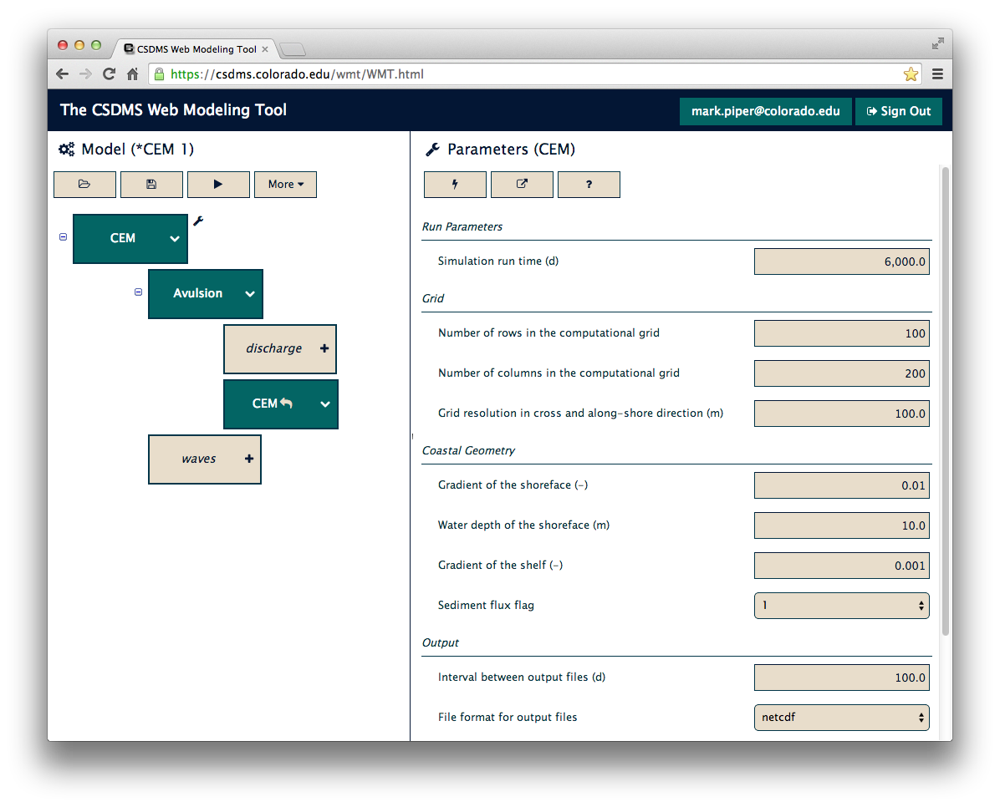

# wmt-client

The [CSDMS](http://csdms.colorado.edu/wiki/Main_Page) Web Modeling Tool,
[WMT](http://csdms.colorado.edu/wiki/WMT_1.0_release),
is a web application that allows users,
from a browser,
to build and run coupled
earth surface process models on a supercomputer.
**wmt-client** is a user interface for WMT.

**wmt-client** is written in Java with [GWT](http://www.gwtproject.org/).
Continuous integration testing is performed with [Travis CI](https://travis-ci.com/),
running [JUnit](http://junit.org/) unit tests
called from [Apache Ant](http://ant.apache.org/).

For a complete description of the **wmt-client** interface,
see [WMT Help](http://csdms.colorado.edu/wiki/WMT_help);
for a brief tutorial,
see the [WMT Tutorial](http://csdms.colorado.edu/wiki/WMT_tutorial).

A live instance of WMT that uses **wmt-client**
is running at https://csdms.colorado.edu/wmt.

## Installation

**wmt-client** has an [install script](https://github.com/csdms/wmt-client/blob/master/scripts/install).
It requires `python` (2.7 or greater), `git`, `ant`, and `javac`.

To install **wmt-client**,
download the `install` script onto the target machine:

    $ wget https://raw.githubusercontent.com/csdms/wmt-client/master/scripts/install

and run the script,
specifying the location of the webserver docroot,
and optionally the WMT API server and execution servers:

    $ python install /path/to/webserver/docroot --api-url='https://foo.org/wmt/api' --execution-servers='foo.org'

If the webserver docroot is root-owned,
the install script will need to be run as root,
or with `sudo`.
Alternately,
add write permissions to the docroot,
run the script as a normal user,
then revert the permissions on the docroot.
